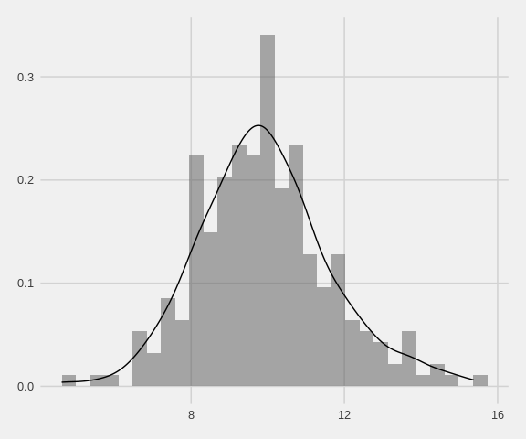
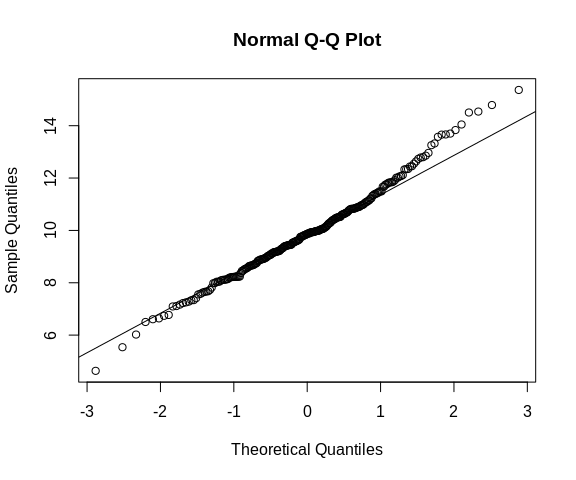
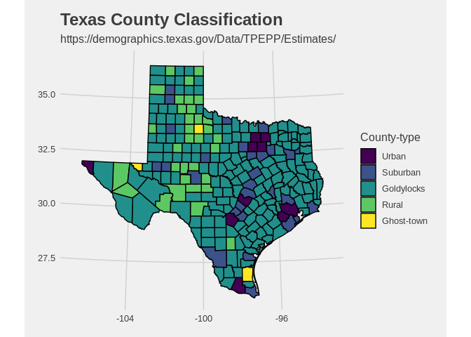
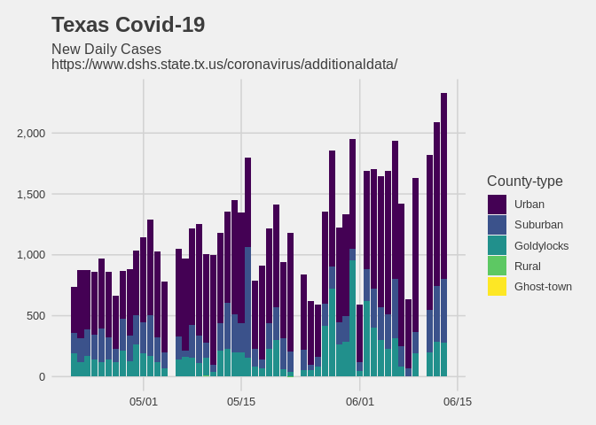
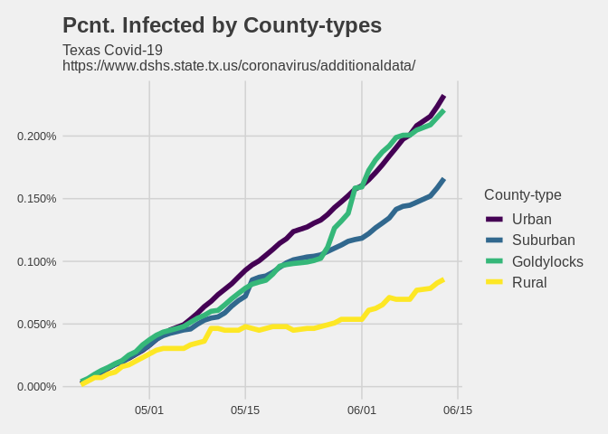
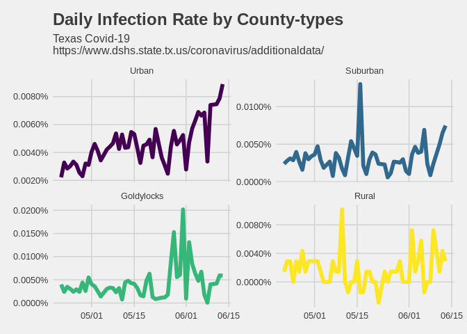
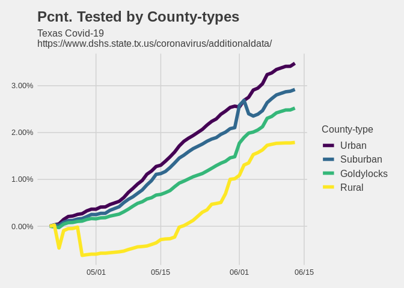
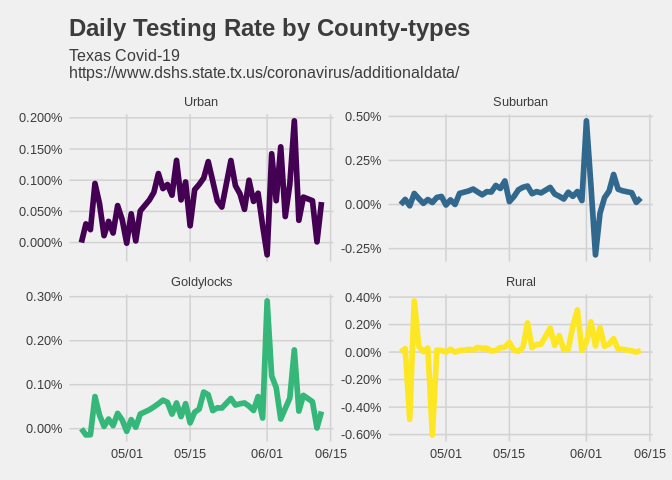

# <u> Can we start wearing masks again? </u>
I am going to keep things light & breezy, but I was hoping that we could all start wearing face-masks again ...
I don't know about how things are in your neck of the woods, but it looks like only 10-20% of people are wearing masks where I live. Ironically, the shelves local superstores are stocked with reasonably priced disposable masks. 

For context -- Texas started re-opening a couple weeks ago and mixed signals are being sent regarding safety. We have state-level guidance, but the situation on the ground really depends the area. Additionally, although we hear alot about increased testing capacity at the national level, we really don't get much granular detail. 

Therefore, it seems like there should be a bottom-up management approach. *Caveat*, I'm not a policy-expert. However, it's my understanding that the Governor's recent order limits the authority of local bodies with regards to face-mask requirements and other matters. This seems silly because - **shocker** - Texas is pretty big and diverse. 

With all that in mind, how do things look when mapping DSHS Covid-19 data on [population data](https://demographics.texas.gov/Data/TPEPP/Estimates/)? 

Well, not super. 

## **Data & Tools**
* Using the most recent county population estimates from demographics.Texas.com.
  - Data is labeled on the page as "2018" but the last estimate appears to be as of Jan 1, 2019.
    Also, county FIPS codes appear off. Why can't we have nice data publications? 
  - Download [link](https://demographics.texas.gov/Resources/TPEPP/Estimates/2018/2018_txpopest_county.csv). 
  
* Geo-spatial mapping courtesy of the urbnmapr package.This thing is super. 
  - [About page](https://medium.com/@urban_institute/how-to-create-state-and-county-maps-easily-in-r-577d29300bb2) on Medium.
  - If you're on a Debian linux distro, you will likely have to download some additional system pacakges to get things to work.
  See helpful [stack-overflow page](https://stackoverflow.com/questions/35647650/unable-to-install-package-car/35650554#35650554?newreg=2811e00f7f6d410c9c04097a1a80b800). 
  
* Using daily cases & testing from my [TexasCovid-project](https://github.com/nikolkj/Texas-Covid/blob/master/README.md). Originally sourced from Texas DSHS. 

## **General Approach**
1. Coarse classification of Texas counties based on population size.
2. Per county-population class, calculate infection & testing rates relative to local populations. 

Excuse the lack of polish - I am cobbling things together from a couple of seperate scripts.

## **County Population Classification**
County populations are log-norally distributed, so I am using standard deviation ranges to break-up the curve into different classes. Any counties above two (2) standard deviations from the mean are classified as "Urban", and it goes down from there.

Jump to the end of this section if you're not too interested in details.

### Classification: Details


```r
# Load Data & Preprocessing
pop = readr::read_csv(file = "../TexasCovid-modeling/2018_txpopest_county.csv", col_names = TRUE, trim_ws = TRUE, col_types = cols()) 

# Simple Pre-processing 
pop = pop %>% 
  select(FIPS, county, jan1_2019_pop_est) %>%
  rename(County = county) %>% 
  filter(County != "State of Texas")

# Standardize [County] names to align with other data-sources
pop = pop %>% 
  mutate(County = stringr::str_to_title(County, locale = "en")) %>% 
  mutate(County = ifelse(County == "De Witt", "Dewitt", County))

# Population Splitting in [pop] ----
# Visual spot checks for normallity
pop %>%
  mutate(value = log(jan1_2019_pop_est)) %>%
  # normally distributed
  ggplot(data = ., mapping = aes(x = value)) +
  geom_histogram(aes(y =..density..), alpha = .5, bins = 30) +
  geom_density() +
  ggthemes::theme_fivethirtyeight()
```



```r
  # QQ-plots, looks good enough
  pop %$% log(jan1_2019_pop_est) %>% qqnorm(y = .)
  pop %$% log(jan1_2019_pop_est) %>% qqline(y =.)
```



```r
# Scale population values
pop = pop %>% 
  mutate(value = log(jan1_2019_pop_est))

# Calc mean, sd
pop_bounds = pop %$% c(mean(value), sd(value)) 

# Segment into (5)-groups 
# ..High, >= m+2sd ... 5
# .. m+1sd < Mod-High < m+2sd ... 4
# .. m-1sd < Moderate < m+1sd ... 3
# .. m-2d < Mod-Low < m - 1d ... 2
# ..Low, =< m-2d ... 1

# Calc bounds
pop_bounds = c(pop_bounds[1] - (2*pop_bounds[2]),
               pop_bounds[1] - pop_bounds[2],
               pop_bounds[1] + pop_bounds[2],
               pop_bounds[1] + (2*pop_bounds[2])
               )
# Map Groups
pop = pop %>%
  mutate(pop_group = ifelse(
    test = (value <= pop_bounds[1]),
    yes = 1,
    no = ifelse(
      test = (value > pop_bounds[1] & value < pop_bounds[2]),
      yes = 2,
      no = ifelse(
        test = (value > pop_bounds[2] & value < pop_bounds[3]),
        yes = 3,
        no = ifelse(
          test = (value > pop_bounds[3] &
                    value < pop_bounds[4]),
          yes = 4,
          no = 5
        )
      )
    )
  ))

# Import and Pre-process shapefiles from urbnmapr-package
texas_geo = urbnmapr::counties %>% filter(state_name == "Texas")
texas_geo = texas_geo %>% 
  # Create Stanardized "County" field that allows easy matching 
  # ... to population, demographic and covid data
  # ... FIPS in population & demographis data appears to be invalid,
  # ... ... therefore join over corresponding ubrnmapr::counties field will not work
  mutate(County = stringr::str_remove(county_name, "\\s*County"),
         County = stringr::str_to_title(County)) 

# Join data & shapes
pop_maps = pop %>% 
  left_join(x = ., 
            y = texas_geo, 
            by = "County")

# Set plotting limits
lat_lims = c(min(pop_maps$lat, na.rm = TRUE), 
             max(pop_maps$lat, na.rm = TRUE))
```

### Classification: Results

Things seem to make sense intuitively: Houston, Dallas, Austin, San Antonio and El Paso regions are classified as "Urban" and their neighboring counties are "Suburban".

I've dubbed everything in the `m-1*sd < x < m+1*sd` range as "Goldylocks" since it's right in the middle, above "Rural". 


```r
# Plot Texas counties with population-group classifications
pop_maps %>% 
  mutate(pop_group = factor(pop_group, levels = c("1", "2", "3", "4", "5"), 
                            labels = c("Ghost-town", "Rural", "Goldylocks", "Suburban", "Urban"),
                            ordered = TRUE)) %>%
  mutate(pop_group = forcats::fct_rev(pop_group)) %>%
  ggplot(data = ., mapping = aes(x = long, y = lat, group = group, fill = pop_group)) +
  geom_polygon(color = "black") + 
  coord_map(projection = "albers", lat0 = lat_lims[1], lat1 = lat_lims[2]) +
  xlab("") + ylab("") +
  labs(fill = "County-type") +
  ggthemes::theme_fivethirtyeight() +
  ggtitle(label = "Texas County Classification", 
          subtitle = "https://demographics.texas.gov/Data/TPEPP/Estimates/") + 
  theme(legend.position = "right", legend.direction = "vertical")
```

<!-- -->

### Overlaying Population & TexasCovid Data

```r
# Short-cut, already have a data object loaded with case, test and death data
dat_ts = readRDS(file = "../TexasCovid-modeling/dat_ts.RDS") # as-of 06/15/2020

head(pop)
```

```
## # A tibble: 6 x 5
##   FIPS  County    jan1_2019_pop_est value pop_group
##   <chr> <chr>                 <dbl> <dbl>     <dbl>
## 1 001   Anderson              58854 11.0          3
## 2 003   Andrews               19232  9.86         3
## 3 005   Angelina              92353 11.4          3
## 4 007   Aransas               23031 10.0          3
## 5 009   Archer                 9625  9.17         3
## 6 011   Armstrong              1949  7.58         2
```

```r
# Prepare data
dat_pop = dat_ts %>% group_by(County) %>% unnest(data) 
dat_pop = pop %>% select(County, pop_group) %>%
  left_join(x = dat_pop, y = ., by = "County")

dat_pop = dat_pop %>% 
  select(County, Date, DailyCount_tests, DailyDelta_tests, 
         DailyCount_cases, DailyDelta_cases, pop_group)

# Data-table preview, top 5 observations
head(dat_pop, width = 9) %>%
  knitr::kable() %>%
  kableExtra::kable_styling(bootstrap_options = c("striped", "hover"))
```

<table class="table table-striped table-hover" style="margin-left: auto; margin-right: auto;">
 <thead>
  <tr>
   <th style="text-align:left;"> County </th>
   <th style="text-align:left;"> Date </th>
   <th style="text-align:right;"> DailyCount_tests </th>
   <th style="text-align:right;"> DailyDelta_tests </th>
   <th style="text-align:right;"> DailyCount_cases </th>
   <th style="text-align:right;"> DailyDelta_cases </th>
   <th style="text-align:right;"> pop_group </th>
  </tr>
 </thead>
<tbody>
  <tr>
   <td style="text-align:left;"> Anderson </td>
   <td style="text-align:left;"> 2020-04-21 </td>
   <td style="text-align:right;"> 270 </td>
   <td style="text-align:right;"> 0 </td>
   <td style="text-align:right;"> 10 </td>
   <td style="text-align:right;"> 2 </td>
   <td style="text-align:right;"> 3 </td>
  </tr>
  <tr>
   <td style="text-align:left;"> Anderson </td>
   <td style="text-align:left;"> 2020-04-22 </td>
   <td style="text-align:right;"> 282 </td>
   <td style="text-align:right;"> 12 </td>
   <td style="text-align:right;"> 14 </td>
   <td style="text-align:right;"> 4 </td>
   <td style="text-align:right;"> 3 </td>
  </tr>
  <tr>
   <td style="text-align:left;"> Anderson </td>
   <td style="text-align:left;"> 2020-04-23 </td>
   <td style="text-align:right;"> 297 </td>
   <td style="text-align:right;"> 15 </td>
   <td style="text-align:right;"> 14 </td>
   <td style="text-align:right;"> 0 </td>
   <td style="text-align:right;"> 3 </td>
  </tr>
  <tr>
   <td style="text-align:left;"> Anderson </td>
   <td style="text-align:left;"> 2020-04-24 </td>
   <td style="text-align:right;"> 329 </td>
   <td style="text-align:right;"> 32 </td>
   <td style="text-align:right;"> 16 </td>
   <td style="text-align:right;"> 2 </td>
   <td style="text-align:right;"> 3 </td>
  </tr>
  <tr>
   <td style="text-align:left;"> Anderson </td>
   <td style="text-align:left;"> 2020-04-25 </td>
   <td style="text-align:right;"> 337 </td>
   <td style="text-align:right;"> 8 </td>
   <td style="text-align:right;"> 16 </td>
   <td style="text-align:right;"> 0 </td>
   <td style="text-align:right;"> 3 </td>
  </tr>
  <tr>
   <td style="text-align:left;"> Anderson </td>
   <td style="text-align:left;"> 2020-04-26 </td>
   <td style="text-align:right;"> 337 </td>
   <td style="text-align:right;"> 0 </td>
   <td style="text-align:right;"> 18 </td>
   <td style="text-align:right;"> 2 </td>
   <td style="text-align:right;"> 3 </td>
  </tr>
</tbody>
</table>

```r
# Clean-up county-classifcation, "pop-group" levels and reaggregated data over classes
dat_pop = dat_pop %>% 
  mutate(pop_group = factor(pop_group, levels = c("1", "2", "3", "4", "5"), 
                            labels = c("Ghost-town", "Rural", "Goldylocks", "Suburban", "Urban"),
                            ordered = TRUE)) %>%
  mutate(pop_group = forcats::fct_rev(pop_group)) %>%
  group_by(pop_group, Date) %>%
  summarise(DailyCount_cases = sum(DailyCount_cases),
            DailyCount_tests = sum(DailyCount_tests),
            DailyDelta_cases = sum(DailyDelta_cases),
            DailyDelta_tests = sum(DailyDelta_tests)
  ) 
```

```
## `summarise()` regrouping output by 'pop_group' (override with `.groups` argument)
```

```r
# Data-table preview, top 5 observations
head(dat_pop) %>%
  knitr::kable() %>%
  kableExtra::kable_styling(bootstrap_options = c("striped", "hover"))
```

<table class="table table-striped table-hover" style="margin-left: auto; margin-right: auto;">
 <thead>
  <tr>
   <th style="text-align:left;"> pop_group </th>
   <th style="text-align:left;"> Date </th>
   <th style="text-align:right;"> DailyCount_cases </th>
   <th style="text-align:right;"> DailyCount_tests </th>
   <th style="text-align:right;"> DailyDelta_cases </th>
   <th style="text-align:right;"> DailyDelta_tests </th>
  </tr>
 </thead>
<tbody>
  <tr>
   <td style="text-align:left;"> Urban </td>
   <td style="text-align:left;"> 2020-04-21 </td>
   <td style="text-align:right;"> 13690 </td>
   <td style="text-align:right;"> 104110 </td>
   <td style="text-align:right;"> 379 </td>
   <td style="text-align:right;"> 0 </td>
  </tr>
  <tr>
   <td style="text-align:left;"> Urban </td>
   <td style="text-align:left;"> 2020-04-22 </td>
   <td style="text-align:right;"> 14250 </td>
   <td style="text-align:right;"> 109221 </td>
   <td style="text-align:right;"> 560 </td>
   <td style="text-align:right;"> 5111 </td>
  </tr>
  <tr>
   <td style="text-align:left;"> Urban </td>
   <td style="text-align:left;"> 2020-04-23 </td>
   <td style="text-align:right;"> 14737 </td>
   <td style="text-align:right;"> 112770 </td>
   <td style="text-align:right;"> 487 </td>
   <td style="text-align:right;"> 3549 </td>
  </tr>
  <tr>
   <td style="text-align:left;"> Urban </td>
   <td style="text-align:left;"> 2020-04-24 </td>
   <td style="text-align:right;"> 15254 </td>
   <td style="text-align:right;"> 128964 </td>
   <td style="text-align:right;"> 517 </td>
   <td style="text-align:right;"> 16194 </td>
  </tr>
  <tr>
   <td style="text-align:left;"> Urban </td>
   <td style="text-align:left;"> 2020-04-25 </td>
   <td style="text-align:right;"> 15825 </td>
   <td style="text-align:right;"> 139658 </td>
   <td style="text-align:right;"> 571 </td>
   <td style="text-align:right;"> 10694 </td>
  </tr>
  <tr>
   <td style="text-align:left;"> Urban </td>
   <td style="text-align:left;"> 2020-04-26 </td>
   <td style="text-align:right;"> 16358 </td>
   <td style="text-align:right;"> 141564 </td>
   <td style="text-align:right;"> 533 </td>
   <td style="text-align:right;"> 1906 </td>
  </tr>
</tbody>
</table>

## **How Do Things Look?**

### Cases

Although the new cases are beginning to level of in the US, new daily cases in Texas continue to grow. Everyone was up in arms a couple months ago, panick buying and refusing to go outside. Objectively, the situation is worse now than it was before.  


```r
dat_pop %>%
  filter(!is.na(pop_group)) %>% 
  ggplot(data = ., mapping = aes(x = Date, y = DailyDelta_cases, fill = pop_group)) +
  geom_col() + 
  scale_y_continuous(labels = scales::number_format(accuracy = 1, big.mark = ",")) + 
  scale_x_date(labels = scales::date_format(format = "%m/%d")) +
  xlab("") + ylab("") +
  ggthemes::theme_fivethirtyeight() +
  ggtitle(label = "Texas Covid-19", 
          subtitle = "New Daily Cases\nhttps://www.dshs.state.tx.us/coronavirus/additionaldata/") +
  labs(fill = "County-type") +
  theme(legend.position = "right", legend.direction = "vertical")
```

<!-- -->


Now, what if we represent new cases and tests as fractions of the underlying populations?
Queue some more data-wrangling.


```r
pop_net_by_group = pop %>% group_by(pop_group) %>% 
  summarise(jan1_2019_pop_est = sum(jan1_2019_pop_est), 
            dplyr.summarise.inform = FALSE) %>%
  mutate(pop_group = factor(pop_group, levels = c("1", "2", "3", "4", "5"), 
                            labels = c("Ghost-town", "Rural", "Goldylocks", "Suburban", "Urban"),
                            ordered = TRUE)) %>%
  mutate(pop_group = forcats::fct_rev(pop_group))
```

```
## `summarise()` ungrouping output (override with `.groups` argument)
```

```r
dat_rates = dat_pop %>%
  left_join(x = ., y = pop_net_by_group, by = "pop_group") %>% 
  ungroup() %>% 
  mutate(infection_rate = DailyDelta_cases / jan1_2019_pop_est,
         testing_rate = DailyDelta_tests / jan1_2019_pop_est) %>% 
  group_by(pop_group) %>% 
  arrange(Date) %>%
  mutate(infected = cumsum(infection_rate),
         tested = cumsum(testing_rate))
```

Population infection rates have been pretty stable for both "Urban" and "Suburban" regions with about 2 people per 1,000 contracting the virus, to-date. Although this might not seem like much, consider how many people visit your local Walmart/Kroger/HEB every-day. 

```r
# Plot: Pcnt. Infected by County-types
dat_rates %>% 
  filter(!is.na(pop_group) & pop_group %nin% c("Ghost-town")) %>%
  ggplot(data = ., mapping = aes(x = Date, y = infected, col = pop_group, fill = pop_group)) +
  geom_line(size = 2) + 
  scale_y_continuous(labels = scales::percent_format()) + 
  scale_x_date(labels = scales::date_format(format = "%m/%d")) +
  xlab("") + ylab("") +
  labs(col = "County-type") +
  ggtitle(label = "Pcnt. Infected by County-types", subtitle = "Texas Covid-19\nhttps://www.dshs.state.tx.us/coronavirus/additionaldata/") +
  ggthemes::theme_fivethirtyeight() +
  theme(legend.text = element_text(size = 12), legend.position = "right", legend.direction = "vertical")
```

<!-- -->

Another thing to keep in mind is how case data is compiled. Overall testing is low (see below) regardless of region. Most cases are likely being tallied when people are sick enough to go see their doctor. Therefore, we are probably dealing with a sizeable under-report of actual cases. 

Finally, it's fairly interesting how infection-rates accelerated for "Goldylocks" counties around the Memorial Day holiday. This is a guess, but the relatively lower population density in those counties probably makes people feel safer, leading to greater congregations during the holidays. Consequently, the percent of the population that's been infected in these regions is now on par with dense urban regions. Unfortunately, these regions have less local hospital capacitiy, so they may ironically carry a higher long-term mortality risk. 


```r
# Plot: Infection Rate by County-types  
dat_rates %>% 
  filter(!is.na(pop_group) & pop_group %nin% c("Ghost-town")) %>%
  ggplot(data = ., mapping = aes(x = Date, y = infection_rate, col = pop_group, fill = pop_group)) +
  geom_line(size = 2) + 
  scale_y_continuous(labels = scales::percent_format()) + 
  scale_x_date(labels = scales::date_format(format = "%m/%d")) +
  xlab("") + ylab("") +
  labs(NULL) +
  ggtitle(label = "Daily Infection Rate by County-types", subtitle = "Texas Covid-19\nhttps://www.dshs.state.tx.us/coronavirus/additionaldata/") +
  ggthemes::theme_fivethirtyeight() +
  theme(legend.position = "none") +
  facet_wrap(.~pop_group, scales = "free_y")
```

<!-- -->

<br></br>
To further complicate the picture, new infection rates are spiking in "Urban" and "Suburban" regions due to recent protests and more relaxed social distancing practices. Generally, this is why I think more localized authority makes sense. Situations are diverging all over the state, so current state-wide measures may be over-kill in some regions and entirely lacking in others. 

At the end of the day though, at least we have data and we aren't flying blind - or are we?

### Tests

Although we hear alot about increased testing, there really isn't a whole lot going on. Can you tell me what your state's active testing and contact tracing efforts are? I can't. Depending on the region, only 2-3.5% of the population has been tested and it's taken us more than month to get that high. Again, it's important to take things with a grain of salt because this assumes no re-tests and doesn't differentiate between active-infection and anti-body testing. 


```r
# Plot: Pcnt. Tested by County-types
dat_rates %>% 
  filter(!is.na(pop_group) & pop_group %nin% c("Ghost-town")) %>%
  ggplot(data = ., mapping = aes(x = Date, y = tested, col = pop_group, fill = pop_group)) +
  geom_line(size = 2) + 
  scale_y_continuous(labels = scales::percent_format()) + 
  scale_x_date(labels = scales::date_format(format = "%m/%d")) +
  xlab("") + ylab("") +
  labs(col = "County-type") +
  ggtitle(label = "Pcnt. Tested by County-types", subtitle = "Texas Covid-19\nhttps://www.dshs.state.tx.us/coronavirus/additionaldata/") +
  ggthemes::theme_fivethirtyeight() +
  theme(legend.text = element_text(size = 12), legend.position = "right", legend.direction = "vertical")
```

<!-- -->

Finally, there isn't any sort of trend in the daily-testing data. It's all extremely noisey, so any sustained increase in testing-capacity is yet to be reflected in the data.

```r
# Plot: Testing Rate by County-types  
dat_rates %>% 
  filter(!is.na(pop_group) & pop_group %nin% c("Ghost-town")) %>%
  ggplot(data = ., mapping = aes(x = Date, y = testing_rate, col = pop_group, fill = pop_group)) +
  geom_line(size = 2) + 
  scale_y_continuous(labels = scales::percent_format()) + 
  scale_x_date(labels = scales::date_format(format = "%m/%d")) +
  xlab("") + ylab("") +
  labs(NULL) +
  ggtitle(label = "Daily Testing Rate by County-types", subtitle = "Texas Covid-19\nhttps://www.dshs.state.tx.us/coronavirus/additionaldata/") +
  ggthemes::theme_fivethirtyeight() +
  theme(legend.position = "none") +
  facet_wrap(.~pop_group, scales = "free_y")
```

<!-- -->

<br></br>
<br></br>
<br></br>
<br></br>
**Oof.**
